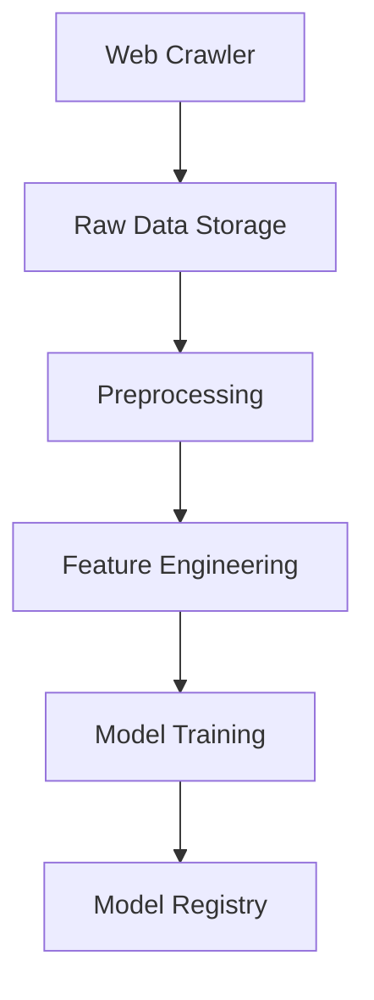

# E-commerce Price Prediction Pipeline

This project is an **end-to-end ML Engineering pipeline** for predicting product prices using **web crawled data** from e-commerce websites.  
The pipeline is fully automated with **Apache Airflow**, starting from data crawling to model training.

---

## 📂 Project Structure
```
ecommerce_price_prediction/
│── dags/
│ └── ecommerce_pipeline.py                # Airflow DAG
│── src/
│ ├── crawler.py                           # Web crawler (scrapes product data)
│ ├── preprocess.py                        # Data cleaning & preprocessing
│ ├── feature_engineering.py               # Feature creation
│ └── train_model.py                       # Model training
│── data/
│ ├── raw/                                 # Raw crawled data
│ └── processed/                           # Cleaned & feature-engineered data
│── models/
│ └── price_predictor.pkl                  # Trained ML model
│── requirements.txt                       # Dependencies
```


---

## Workflow



Step 1 – Crawler: Collects product data (title, price, rating) from an e-commerce website.

Step 2 – Preprocessing: Cleans missing values, converts prices, and normalizes data.

Step 3 – Feature Engineering: Creates additional features (e.g., rating score, price bucket).

Step 4 – Model Training: Trains a RandomForestRegressor to predict product prices.

Step 5 – Deployment (future work): Serve predictions via API (FastAPI/Flask).

# Getting Started
Clone Repository
```
git clone https://github.com/your-username/Ecommerce-web_crowler.git
cd Ecommerce-web_crowler
```

---

Create Virtual Environment
```
python -m venv venv
source venv/bin/activate   # Linux / Mac
venv\Scripts\activate      # Windows
```

---

Install Dependencies
```
pip install -r requirements.txt
```

---

Run main.py
```
python src/main.py
```

---

Run with Airflow

Start Airflow webserver and scheduler:
```
airflow db init
airflow webserver --port 8080
airflow scheduler
```

---

# Place ecommerce_pipeline.py inside dags/ folder.
Open http://localhost:8080 and trigger the DAG.

---
# Example Output
Raw data: data/raw/products_YYYYMMDD.csv

Processed data: data/processed/cleaned_data.csv

Feature data: data/processed/features.csv

Trained model: models/price_predictor.pkl

---

# Tech Stack

Python 3.9+

BeautifulSoup4 – Web scraping

Pandas – Data processing

Scikit-learn – Model training

Joblib – Model saving

Apache Airflow – Workflow orchestration

---

# Future Improvements

Deploy trained model with FastAPI or Flask

Store crawled data in PostgreSQL / S3 / Delta Lake

Add MLflow for model versioning

Implement real-time price monitoring

---

